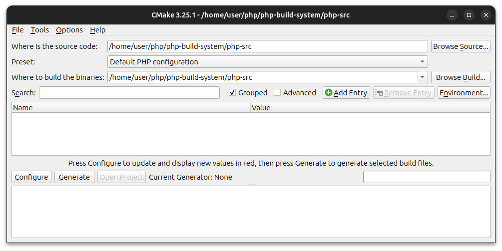
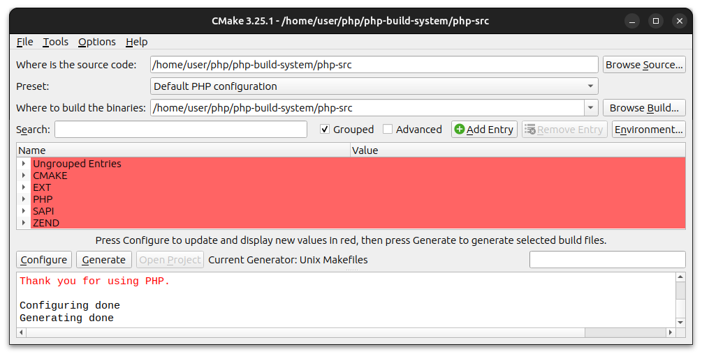
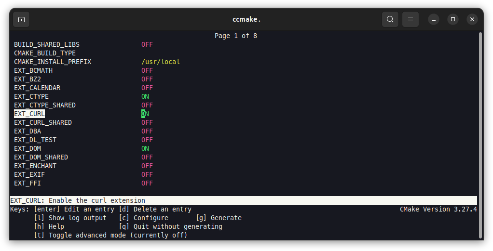
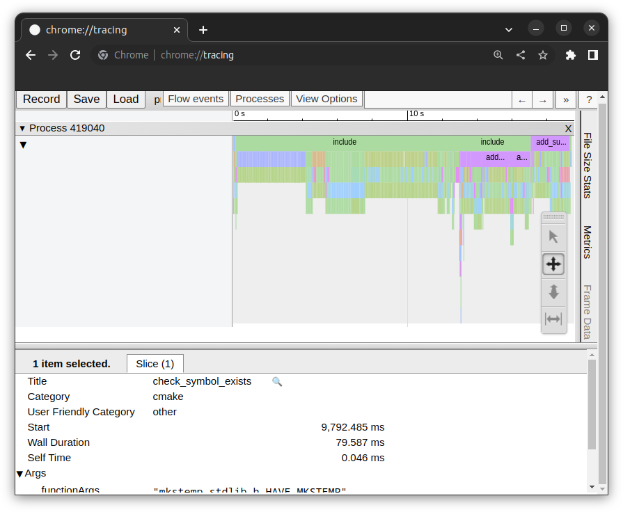

# PHP build system

[](https://www.php.net/)
[](https://cmake.org)
[](https://port70.net/~nsz/c/c99/n1256.html)
[](https://www.gnu.org/)
[](https://ninja-build.org/)

This repository delves into the core of the PHP build system, elucidating the
intricacies of how to build PHP with CMake.


## Quick usage - TL;DR

```sh
# Prerequisites for Debian based distributions:
sudo apt install cmake gcc g++ bison re2c libxml2-dev libsqlite3-dev

# Prerequisites for Fedora based distributions:
sudo dnf install cmake gcc gcc-c++ bison re2c libxml2-devel sqlite-devel

# Prerequisites for FreeBSD:
sudo pkg install cmake bison re2c libxml2 sqlite3

# Clone this repository:
git clone https://github.com/petk/php-build-system

# Download latest PHP and add CMake files:
cmake -P php-build-system/bin/php.cmake

# Generate build system from sources to a new build directory:
cmake -S php-build-system/php-8.4-dev -B my-php-build

# Build PHP in parallel:
cmake --build my-php-build -j

./my-php-build/sapi/cli/php -v
```

## Index

* [1. Introduction](#1-introduction)
* [2. PHP directory structure](#2-php-directory-structure)
* [3. PHP extensions](#3-php-extensions)
* [4. PHP SAPI (Server API) modules](#4-php-sapi-server-api-modules)
* [5. Parser and lexer files](#5-parser-and-lexer-files)
* [6. \*nix build system](#6-nix-build-system)
  * [6.1. \*nix build system diagram](#61-nix-build-system-diagram)
  * [6.2. Build requirements](#62-build-requirements)
  * [6.3. The configure command-line options](#63-the-configure-command-line-options)
* [7. CMake](#7-cmake)
  * [7.1. Why using CMake?](#71-why-using-cmake)
  * [7.2. Directory structure](#72-directory-structure)
  * [7.3. CMake-based PHP build system diagram](#73-cmake-based-php-build-system-diagram)
  * [7.4. CMake usage](#74-cmake-usage)
  * [7.5. CMake minimum version for PHP](#75-cmake-minimum-version-for-php)
  * [7.6. CMake generators for building PHP](#76-cmake-generators-for-building-php)
    * [7.6.1. Unix Makefiles (default)](#761-unix-makefiles-default)
    * [7.6.2. Ninja](#762-ninja)
  * [7.7. CMake GUI](#77-cmake-gui)
  * [7.8. Command-line interface ccmake](#78-command-line-interface-ccmake)
  * [7.9. Testing](#79-testing)
  * [7.10. Performance](#710-performance)
* [8. See more](#8-see-more)
  * [8.1. CMake and PHP](#81-cmake-and-php)
  * [8.2. PHP Internals](#82-php-internals)

## 1. Introduction

PHP developers typically opt for convenient methods to set up PHP on their
machines, such as utilizing prebuilt Linux packages available in their Linux
distribution repositories, deploying Docker images, or relying on user-friendly
stacks that bundle PHP, its extensions, web server, and database into a unified
installation package.

```sh
# Debian-based distributions:
sudo apt install php...

# Fedora-based distributions:
sudo dnf install php...
```

In contrast, the practice of building PHP from source code is primarily reserved
for specific purposes, such as PHP source code development or extensive
customization of PHP configurations on a particular system. This approach is
less commonly employed by everyday PHP developers due to its intricate and
time-consuming nature.

In the realm of software development, a build system is a collection of tools
and files that automate the process of compiling, linking, and assembling the
project's source code into its final form, ready to be executed. It helps
developers with repetitive tasks and ensures consistency and correctness in the
build process for various platforms and hardware out there.

A key function of a build system in the context of C/C++ software development is
to establish a structured framework that guides how C code should be written.
Beyond its primary role of compiling source files into executable programs, the
build system plays a pivotal educational role, imparting best practices and
coding standards to C developers. By enforcing consistency and adherence to
coding conventions, it fosters the creation of high-quality C and C++ code,
ultimately enhancing software maintainability and reliability.

Additionally, the build system aims to enable C developers to work efficiently
by abstracting away system-specific details, allowing them to focus on the logic
and usability of their code. When adding a new C/C++ source file or making minor
modifications, developers shouldn't have to delve into the inner workings of the
build system, sift through extensive build system documentation or extensively
explore the complexities of the underlying system.

There are numerous well-known build systems available for C projects, ranging
from the veteran GNU Autotools and the widely adopted CMake, to the efficient
Ninja, versatile SCons, adaptable Meson, nimble xmake, and even the simplest
manual usage of Make.

PHP build system consist of two parts:

* \*nix build system (Linux, macOS, FreeBSD, OpenBSD, etc.)
* Windows build system

## 2. PHP directory structure

Before we begin, it might be useful to understand directory structure of the PHP
source code. PHP is developed at the
[php-src GitHub repository](https://github.com/php/php-src).

After cloning the repository:

```sh
git clone https://github.com/php/php-src
cd php-src
```

you end up with a large monolithic repository consisting of C source code files,
PHP tests and other files:

```sh
<php-src>/
 ├─ .git/                         # Git configuration and source directory
 ├─ appveyor/                     # Appveyor CI service files
 ├─ benchmark/                    # Benchmark some common applications in CI
 ├─ build/                        # *nix build system files
 ├─ docs/                         # PHP internals documentation
 └─ ext/                          # PHP core extensions
    └─ bcmath/                    # The bcmath PHP extension
       ├─ libbcmath/              # The bcmath library forked and maintained in php-src
       ├─ tests/                  # *.phpt test files for extension
       ├─ bcmath.stub.php         # A stub file for the bcmath extension functions
       └─ ...
    └─ curl/                      # The curl PHP extension
       ├─ sync-constants.php      # The curl symbols checker
       └─ ...
    └─ date/                      # The date/time PHP extension
       └─ lib/                    # Bundled datetime library https://github.com/derickr/timelib
          └─ ...
       └─ ...
    ├─ dl_test/                   # Extension for testing dl()
    └─ ffi/                       # The FFI PHP extension
       ├─ ffi_parser.c            # Generated by https://github.com/dstogov/llk
       └─ ...
    └─ fileinfo/                  # The fileinfo PHP extension
       ├─ libmagic/               # Modified libmagic https://github.com/file/file
       ├─ data_file.c             # Generated by `ext/fileinfo/create_data_file.php`
       ├─ libmagic.patch          # Modifications patch from upstream libmagic
       ├─ magicdata.patch         # Modifications patch from upstream libmagic
       └─ ...
    └─ gd/                        # The GD PHP extension
       ├─ libgd/                  # Bundled and modified GD library https://github.com/libgd/libgd
       └─ ...
    └─ mbstring/                  # The Multibyte string PHP extension
       ├─ libmbfl/                # Forked and maintained in php-src
       ├─ unicode_data.h          # Generated by `ext/mbstring/ucgendat/ucgendat.php`
       └─ ...
    └─ opcache/                   # The OPcache PHP extension
       └─ jit/                    # OPcache Jit
          └─ dynasm/              # DynASM ARM encoding engine
             ├─ minilua.c         # Customized Lua scripting language to build LuaJIT
             └─ ...
          ├─ zend_jit_x86.c       # Generated by minilua
          └─ ...
    └─ pcre/                      # The PCRE PHP extension
       ├─ pcre2lib/               # https://www.pcre.org/
       └─ ...
    ├─ skeleton/                  # Skeleton for developing new extensions with `ext/ext_skel.php`
    └─ standard/                  # Always enabled core extension
       └─ html_tables/
          ├─ mappings/            # https://www.unicode.org/Public/MAPPINGS/
          └─ ...
       ├─ credits_ext.h           # Generated by `scripts/dev/credits`
       ├─ credits_sapi.h          # Generated by `scripts/dev/credits`
       ├─ html_tables.h           # Generated by `ext/standard/html_tables/html_table_gen.php`
       └─ ...
    └─ tokenizer/                 # The tokenizer PHP extension
       ├─ tokenizer_data.c        # Generated by `ext/tokenizer/tokenizer_data_gen.php`
       ├─ tokenizer_data_stub.php # Generated by `ext/tokenizer/tokenizer_data_gen.php`
       └─ ...
    └─ zend_test                  # For testing internal APIs. Not needed for regular builds
       └─ ...
    └─ zip/                       # Bundled https://github.com/pierrejoye/php_zip
       └─ ...
    ├─ ...
    └─ ext_skel.php               # Helper script that creates a new PHP extension
 └─ main/                         # Binding that ties extensions, SAPIs, Zend engine and TSRM together
    ├─ streams/                   # Streams layer subsystem
    └─ ...
 ├─ modules/                      # Shared libraries, created when building PHP
 ├─ pear/                         # PEAR installation
 └─ sapi/                         # PHP SAPI (Server API) modules
    └─ cli/                       # Command-line PHP SAPI module
       ├─ mime_type_map.h         # Generated by `sapi/cli/generate_mime_type_map.php`
       └─ ...
    └─ ...
 ├─ scripts/                      # php-config, phpize and internal development scripts
 ├─ tests/                        # Core features tests
 ├─ travis/                       # Travis CI service files
 ├─ TSRM/                         # Thread safe resource manager
 └─ Zend/                         # Zend engine
    ├─ asm/                       # Bundled from src/asm in https://github.com/boostorg/context
    ├─ Optimizer/                 # For faster PHP execution through opcode caching and optimization
    ├─ tests/                     # PHP tests *.phpt files for Zend engine
    ├─ zend_vm_execute.h          # Generated by `Zend/zend_vm_gen.php`
    ├─ zend_vm_opcodes.c          # Generated by `Zend/zend_vm_gen.php`
    ├─ zend_vm_opcodes.h          # Generated by `Zend/zend_vm_gen.php`
    └─ ...
 └─ win32/                        # Windows build system files
    ├─ cp_enc_map.c               # Generated by `win32/cp_enc_map_gen.exe`
    └─ ...
 └─ ...
```

The following diagram briefly displays, how PHP libraries (in terms of a build
system) are linked together:


## 3. PHP extensions

PHP has several ways to install PHP extensions:

* Statically linked to PHP

  This is the default way. Extension is built together with PHP SAPI and no
  enabling is needed in the `php.ini` configuration.

* Shared modules

  This installs the extension as dynamically loadable library. Extension to be
  visible in the PHP SAPI (see `php -m`) needs to be also manually enabled in
  the `php.ini` configuration:

  ```ini
  extension=php_extension_lowercase_name
  ```

  This will load the PHP extension module file (shared object) located in the
  extension directory (the `extension_dir` INI directive). File can have `.so`
  extension on *nix systems, `.dll` on Windows, and possibly other extensions
  such as `.sl` on certain HP-UX systems, or `.dylib` on macOS.

The following extensions are always enabled and are part of the overall PHP
engine source code:

* `ext/date`
* `ext/hash`
* `ext/json`
* `ext/pcre`
* `ext/random`
* `ext/reflection`
* `ext/spl`
* `ext/standard`

PHP extensions ecosystem also consists of the [PECL](https://pecl.php.net)
extensions. These can be installed with a separate tool `pecl`:

```sh
pecl install php_extension_name
```

PECL tool is a simple shell script wrapper around the PHP code as part of the
[pear-core](https://github.com/pear/pear-core/blob/master/scripts/pecl.sh)
repository.

## 4. PHP SAPI (Server API) modules

PHP works through the concept of SAPI modules located in the `sapi` directory.

When running PHP on the command line, the cli SAPI module is used:

```sh
/sapi/cli/php -v
```

* [Embed SAPI module](/docs/embed.md)

There are other SAPI modules located in the ecosystem:

* [frankenphp](https://github.com/dunglas/frankenphp)
* [ngx-php](https://github.com/rryqszq4/ngx-php)
* ...

## 5. Parser and lexer files

Some source files are generated with 3rd party tools. These include so called
parser and lexer files which are generated with [re2c](https://re2c.org/) and
[bison](https://www.gnu.org/software/bison/).

Parser files are generated from `*.y` source using `bison` tool to C source code
and header files.

Lexer files are generated from `*.l` and `*.re` source files using `re2c` tool
to C source code and header files.

There is a helper shell script available that generates all these files when
developing PHP source, otherwise they are generated upon `make` step based on
the `Makefile.frag` files.

```sh
./scripts/dev/genfiles
```

```sh
<php-src>/
 └─ build/
    ├─ php.m4                       # PHP Autoconf macros (re2c and bison macros are here)
    └─ ...
 └─ ext/
    ├─ ...
    └─ date/
       └─ lib/
          ├─ parse_date.c           # Generated by re2c 0.15.3
          ├─ parse_iso_intervals.c  # Generated by re2c 0.15.3
          └─ ...
       └─ ...
    └─ ffi/
       ├─ ffi_parser.c              # Manually generated by https://github.com/dstogov/llk
       └─ ...
    └─ json/
       ├─ json_parser.tab.c         # Generated with bison
       ├─ json_parser.tab.h         # Generated with bison
       ├─ json_parser.y             # Parser source
       ├─ json_scanner.c            # Generated with re2c
       ├─ json_scanner.re           # Lexer source
       ├─ Makefile.frag             # Makefile fragment
       ├─ php_json_scanner_defs.h   # Generated with re2c
       └─ ...
    └─ pdo/
       ├─ Makefile.frag             # Makefile fragment
       ├─ pdo_sql_parser.c          # Generated with re2c
       ├─ pdo_sql_parser.re         # Source for re2c
       └─ ...
    └─ phar/
       ├─ Makefile.frag             # Makefile fragment
       ├─ phar_path_check.c         # Generated with re2c
       ├─ phar_path_check.re        # Source for re2c
       └─ ...
    └─ standard/
       ├─ Makefile.frag             # Makefile fragment
       ├─ url_scanner_ex.c          # Generated with re2c
       ├─ url_scanner_ex.re         # Source for re2c
       ├─ var_unserializer.c        # Generated with re2c
       ├─ var_unserializer.re       # Source for re2c
       └─ ...
    └─ ...
 └─ sapi/
    └─ phpdbg/
       ├─ phpdbg_lexer.c            # Generated with re2c
       ├─ phpdbg_lexer.l            # Source for re2c
       ├─ phpdbg_parser.c           # Generated with bison
       ├─ phpdbg_parser.h           # Generated with bison
       ├─ phpdbg_parser.y           # Source for bison
       ├─ phpdbg_parser.output      # Generated with bison
       └─ ...
    └─ ...
 └─ scripts/
    └─ dev/
       ├─ genfiles                  # Parser and lexer files generator helper
       └─ ...
    └─ ...
 └─ Zend/
    ├─ Makefile.frag                # Part of Makefile related to Zend files
    ├─ zend_ini_parser.c            # Generated with bison
    ├─ zend_ini_parser.h            # Generated with bison
    ├─ zend_ini_parser.output       # Generated with bison
    ├─ zend_ini_parser.y            # Parser source
    ├─ zend_ini_scanner.c           # Generated with re2c
    ├─ zend_ini_scanner.l           # Lexer source
    ├─ zend_ini_scanner_defs.h      # Generated with re2c
    ├─ zend_language_parser.c       # Generated with bison
    ├─ zend_language_parser.h       # Generated with bison
    ├─ zend_language_parser.output  # Generated with bison
    ├─ zend_language_parser.y       # Parser source
    ├─ zend_language_scanner_defs.h # Generated with re2c
    ├─ zend_language_scanner.c      # Generated with re2c
    ├─ zend_language_scanner.l      # Lexer source
    └─ ...
 ├─ configure.ac                    # Minimum re2c and bison versions settings
 └─ ...
```

## 6. \*nix build system

\*nix build system in PHP uses [Autoconf](https://www.gnu.org/software/autoconf/)
to build a `configure` shell script that further creates main `Makefile` to
build sources to executable binaries.

```sh
./buildconf
./configure
make
```

The `buildconf` is a simple shell script wrapper around `autoconf` and
`autoheader` tools that checks required Autoconf version. It creates `configure`
command-line script and `main/php_config.h.in` header template.

When running the `./configure`, many checks are done based on the running
system. Things like C headers availability, C symbols, required library
dependencies etc.

The `configure` script creates `Makefile` where the `make` command then builds
binary files from C source files. You can optionally pass the `-j` option which
is the number of threads on current system, so it builds faster.

```sh
make -j $(nproc)
```

When compiling is done, the tests can be run with:

```sh
make TEST_PHP_ARGS=-j10 test
```

PHP \*nix build system is pretty much standard GNU Autotools build system with
few customizations. It doesn't use Automake and it bundles some 3rd party files
for easier installation across various systems out there without requiring
installation dependencies. Autotools is a veteran build system present since
early C/C++ days. It is used for most Linux ecosystem out there and it might
cause issues for C developers today.

Build system is a collection of various files across the php-src repository:

```sh
<php-src>/
 └─ build/
    ├─ ax_*.m4             # https://github.com/autoconf-archive/autoconf-archive
    ├─ config-stubs        # Adds extension and SAPI config*.m4 stubs to configure
    ├─ config.guess        # https://git.savannah.gnu.org/cgit/config.git
    ├─ config.sub          # https://git.savannah.gnu.org/cgit/config.git
    ├─ genif.sh            # Generator for the internal_functions* files
    ├─ libtool.m4          # Forked https://git.savannah.gnu.org/cgit/libtool.git
    ├─ ltmain.sh           # Forked https://git.savannah.gnu.org/cgit/libtool.git
    ├─ Makefile.global     # Root Makefile template when configure is run
    ├─ order_by_dep.awk    # Used by genif.sh
    ├─ php.m4              # PHP Autoconf macros
    ├─ pkg.m4              # https://gitlab.freedesktop.org/pkg-config/pkg-config
    ├─ print_include.awk   # Used by genif.sh
    ├─ shtool              # https://www.gnu.org/software/shtool/
    └─ ...
 └─ ext/
    └─ bcmath/
       ├─ config.m4        # Extension's Autoconf file
       └─ ...
    └─ date/
       ├─ config0.m4       # Suffix 0 is priority which includes the file before other config.m4 extension files
       └─ ...
    └─ mysqlnd/
       ├─ config9.m4       # Suffix 9 priority includes the file after other config.m4 files
       └─ ...
    └─ opcache/
       └─ jit/
          ├─ Makefile.frag # Makefile fragment for OPcache Jit
          └─ ...
       ├─ config.m4        # Autoconf file for OPcache extension
       └─ ...
    └─ ...
 └─ main/
    ├─ php_version.h       # Generated by release managers using `configure`
    └─ ...
 ├─ pear/
 └─ sapi/
    └─ cli/
       ├─ config.m4        # Autoconf M4 file for CLI SAPI
       └─ ...
    └─ ...
 ├─ scripts/
 └─ TSRM/
    ├─ threads.m4          # Autoconf macros for pthreads
    ├─ tsrm.m4             # Autoconf macros for TSRM directory
    └─ ...
 └─ Zend/
    ├─ Makefile.frag       # Makefile fragment for Zend engine
    ├─ Zend.m4             # Autoconf macros for Zend directory
    └─ ...
 ├─ buildconf              # Wrapper for autoconf and autoheader tools
 ├─ configure.ac           # Autoconf main input file for constructing configure script
 └─ ...
```

### 6.1. \*nix build system diagram


### 6.2. Build requirements

Before you can build PHP on Linux and other Unix-like systems, you must first
install certain third-party requirements. It's important to note that the names
of these requirements may vary depending on your specific system. For the sake
of simplicity, we will use generic names here. When building PHP from source,
one crucial requirement is a library containing development files. Such
libraries are typically packaged under names like `libfoo-dev`, `libfoo-devel`,
or similar conventions. For instance, to install the `libzip` library, you would
look for the `libzip-dev` (or `libzip-devel`) package.

Required:

* autoconf
* make
* gcc
* g++
* pkg-config
* libxml
* libsqlite3

Additionally required when building from Git repository source code:

* bison
* re2c

Optional:

* libcapstone (for the OPcache `--with-capstone` option)
* libssl (for OpenSSL `--with-openssl`)
* libkrb5 (for the OpenSSL `--with-kerberos` option)
* libaspell and libpspell (for the ext/pspell `--with-pspell` option)
* zlib
  * when using `--enable-gd` with bundled libgd
  * when using `--with-zlib`
  * when using `--with-pdo-mysql` or `--with-mysqli` (option
    `--enable-mysqlnd-compression-support` needs it)
* libpng
  * when using `--enable-gd` with bundled libgd
* libavif
  * when using `--enable-gd` with bundled libgd and `--with-avif` option.
* libwebp
  * when using `--enable-gd` with bundled libgd and `--with-webp` option.
* libjpeg
  * when using `--enable-gd` with bundled libgd and `--with-jpeg` option.
* libxpm
  * when using `--enable-gd` with bundled libgd and `--with-xpm` option.
* libfretype
  * when using `--enable-gd` with bundled libgd and `--with-freetype` option.
* libgd
  * when using `--enable-gd` with external libgd `--with-external-gd`.
* libonig
  * when using `--enable-mbstring`
* libtidy
  * when using `--with-tidy`
* libxslt
  * when using `--with-xsl`
* libzip
  * when using `--with-zip`
* libargon2
  * when using `--with-password-argon2`
* libedit
  * when using `--with-libedit`
* libreadline
  * when using `--with-readline`
* libsnmp
  * when using `--with-snmp`
* libexpat1
  * when using the `--with-expat`
* libacl
  * when using the `--with-fpm-acl`
* libapparmor
  * when using the `--with-fpm-apparmor`
* libselinux1
  * when using the `--with-fpm-selinux`
* libsystemd
  * when using the `--with-fpm-systemd`
* libldap2
  * when using the `--with-ldap`
* libsasl2
  * when using the `--with-ldap-sasl`
* libpq
  * when using the `--with-pgsql` or `--with-pdo-pgsql`
* libmm
  * when using the `--with-mm`
* libdmalloc
  * when using the `--enable-dmalloc`
* freetds
  * when using the `--enable-pdo-dblib`
* libcdb
  * when using the `--with-cdb=DIR`
* liblmdb
  * when using the `--with-lmdb`
* libtokyocabinet
  * when using the `--with-tcadb`
* libgdbm
  * when using the `--with-gdbm`
* libqdbm
  * when using the `--with-qdbm`
* libgdbm or library implementing the ndbm or dbm compatibility interface
  * when using the `--with-dbm` or `--with-ndbm`
* libdb
  * when using the `--with-db4`, `--with-db3`, `--with-db2`, or `--with-db1`

When PHP is built, the development libraries are no longer required to be
installed and only libraries without development files are needed to run newly
built PHP. In example of `ext/zip` extension, the `libzip` package is needed and
so on.

### 6.3. The configure command-line options

With Autoconf, there are two main types of command-line options for the
`configure` script (`--enable-FEATURE` and `--with-PACKAGE`):

* `--enable-FEATURE[=ARG]` and its belonging opposite `--disable-FEATURE`

  `--disable-FEATURE` is the same as `--enable-FEATURE=no`

  These normally don't require 3rd party library or package installed on the
  system. For some extensions, PHP bundles 3rd party dependencies in the
  extension itself. For example, `bcmath`, `gd`, etc.

* `--with-PACKAGE[=ARG]` and its belonging opposite `--without-PACKAGE`

  `--without-PACKAGE` is the same as `--with-PACKAGE=no`

  These require 3rd party package installed on the system. PHP has even some
  libraries bundled in PHP source code. For example, the PCRE library and
  similar.

Others custom options that don't follow this pattern are used for adjusting
specific features during built process.

See `./configure --help` for more info.

This wraps up the \*nix build system using the Autotools.

## 7. CMake

[CMake](https://cmake.org/) is an open-source cross-platform build system
generator created by Kitware and contributors.

### 7.1. Why using CMake?

CMake is today more actively developed and more developers might be familiar
with it. It also makes C code more attractive to new contributors. Many IDEs
provide a good CMake integration for C/C++ projects.

Many things are very similar to Autoconf, which makes maintaining multiple build
systems simpler.

CMake also has a better out of the box support in Windows systems, where
Autotools can run into issues without further adaptations and adjustments in the
build process.

Even though Autotools might be complex and arcane to new developers not
famililar with it, it can still be a very robust and solid build system option
in C/C++ projects on \*nix systems. Many large open-source projects use
Autotools. Some even use it together with CMake.

### 7.2. Directory structure

Directory structure from the CMake perspective looks like this:

```sh
<php-src>/
 └─ cmake/                   # CMake-based PHP build system files
    └─ modules/              # Project specific CMake modules
       └─ PHP/               # PHP utility modules namespace directory
          ├─ */              # Optional module directories with additional files
          └─ *.cmake         # Project customized CMake utility modules
       └─ Zend/              # Zend utility modules namespace directory
          └─ ...
       ├─ Find*.cmake        # Find modules that support the find_package()
       └─ *.cmake            # Any possible additional utility modules
    ├─ *.cmake               # Various CMake configurations and tools
    ├─ cmake-format.json     # cmake-lint and cmake-format tools configuration
    └─ ...
 └─ ext/
    └─ date/
       ├─ CMakeLists.txt     # Extension's CMake file
       └─ ...
    └─ ...
 └─ main/
    ├─ php_config.cmake.h.in # Configuration header template
    ├─ php_version.h         # Generated by release managers using `configure`
    ├─ CMakeLists.txt        # CMake file for main binding
    └─ ...
 └─ pear/
    ├─ CMakeLists.txt        # CMake file for PEAR
    └─ ...
 └─ sapi/
    └─ cli/
       ├─ CMakeLists.txt     # CMake file for SAPI module
       └─ ...
    └─ ...
 ├─ scripts/
 └─ TSRM/
    ├─ CMakeLists.txt        # CMake file for thread safe resource manager
    └─ ...
 └─ Zend/
    ├─ CMakeLists.txt        # Zend engine CMake file
    └─ ...
 ├─ CMakeLists.txt           # Root CMake file
 ├─ CMakePresets.json        # Main CMake presets file
 └─ ...
```

### 7.3. CMake-based PHP build system diagram


### 7.4. CMake usage

```sh
cmake .
cmake --build .
```

### 7.5. CMake minimum version for PHP

The minimum required version of CMake is defined in the top project file
`CMakeLists.txt` using the `cmake_minimum_required()`. Picking the minimum
required CMake version is a compromise between CMake functionalities and CMake
version available on the operating system.

* 3.17
  * `CMAKE_CURRENT_FUNCTION_LIST_DIR` variable
* 3.19
  * `CMakePresets.json` for sharing build configurations
* 3.20
  * `CMAKE_C_BYTE_ORDER`, otherwise manual check should be done
  * `"version": 2` in `CMakePresets.json`
  * `Intl::Intl` IMPORTED target with CMake's FindIntl module
* 3.21
  * `"version": 3` in `CMakePresets.json` (for the `installDir` option)
* 3.22
  * Full condition syntax in `cmake_dependent_option()`
* 3.23
  * `target_sources(FILE_SET)`, otherwise `install(FILES)` should be used when
    installing files to their destinations
* 3.24
  * `CMAKE_COLOR_DIAGNOSTICS`
  * `CMAKE_COMPILE_WARNING_AS_ERROR`, otherwise INTERFACE library should be used
* 3.25
  * `block()` command
  * New `try_run` signature
* 3.27
  * `COMPILE_ONLY` generator expression
* 3.29
  * `CMAKE_LINKER_TYPE`

Currently, the CMake minimum version is set to **3.25** without looking at CMake
available version on the current systems out there. This will be updated more
properly in the future.

CMake versions scheme across the systems is available at
[pkgs.org](https://pkgs.org/download/cmake).

### 7.6. CMake generators for building PHP

When using CMake to build PHP, you have the flexibility to choose from various
build systems through the concept of _generators_. CMake generators determine
the type of project files or build scripts that CMake generates from your
`CMakeLists.txt` file. In this example, we will check the following generators:
Unix Makefiles and Ninja.

#### 7.6.1. Unix Makefiles (default)

The Unix Makefiles generator is the most common and widely used generator for
building projects on Unix-like systems, including Linux and macOS. It generates
traditional `Makefile` that can be processed by the `make` command. To use the
Unix Makefiles generator, you simply specify it as an argument when running
CMake in your build directory.

To generate the `Makefile` for building PHP, create a new directory (often
called `build` or `cmake-build`) and navigate to it using the terminal. Then,
execute the following CMake command:

```sh
cmake -G "Unix Makefiles" /path/to/php-src
```

Replace `/path/to/php-src` with the actual path to the PHP source code on
your system (in case build directory is the same as the source directory, use
`.`). CMake will process the `CMakeLists.txt` file in the source directory and
generate the `Makefile` in the current build directory.

After the Makefiles are generated, you can use the make command to build PHP:

```sh
make
```

The make command will build the PHP binaries and libraries according to the
configuration specified in the `CMakeLists.txt` file. If you want to speed up
the build process, you can use the `-j` option to enable parallel builds, taking
advantage of multiple CPU cores:

```sh
make -j$(nproc) # number of CPU cores you want to utilize.
```

#### 7.6.2. Ninja

[Ninja](https://ninja-build.org/) is another build system supported by CMake and
is known for its fast build times due to its minimalistic design. To use the
Ninja generator, you need to have Ninja installed on your system. Most package
managers on Unix systems offer Ninja as a package, so you can install it easily.

To generate Ninja build files for building PHP, navigate to your build directory
in the terminal and run the following CMake command:

```sh
cmake -G "Ninja" /path/to/php-src
```

Again, replace `/path/to/php/src` with the actual path to the PHP source code.
CMake will generate the Ninja build files in the current directory.

To build PHP with Ninja, execute the following command:

```sh
ninja
```

Ninja will then handle the build process based on the CMake configuration.

### 7.7. CMake GUI

With CMake there comes also a basic graphical user interface to configure and
generate the build system.

Inside a CMake project, run:

```sh
cmake-gui .
```



Here the build configuration can be done, such as enabling the PHP extensions,
adjusting the build options and similar.

CMake GUI makes it simpler to see available build options and settings and it
also conveniently hides and sets the dependent options. For example, if some PHP
extension provides multiple configuration options and it is disabled, the
dependent options won't be displayed after configuration.


After setting up, press the `Configure` button to start the configuration phase
and prepare the build configuration. The `Generate` buttons can then generate
the chosen build system.



GUI is only meant to configure and generate the build in user-friendly way.
Building the sources into binaries can be then done using the command line or an
IDE.

```sh
cmake --build --preset default
```

### 7.8. Command-line interface ccmake

The CMake curses interface (`ccmake`) is a command-line GUI, similar to the
CMake GUI, that simplifies the project configuration process in an intuitive and
straightforward manner.

```sh
# Run ccmake:
ccmake -S source-directory -B build-directory

# For in-source builds:
ccmake .
```



* `c` key will run the configuration step
* `g` key will run the generation step (you might need to press `c` again)

Much like the CMake GUI, the build step is executed on the command line
afterward.

```sh
# Build the project sources from the specified build directory:
cmake --build build-directory -j
```

`ccmake` does not support presets but can be utilized for simpler configurations
during development and for similar workflows.

### 7.9. Testing

PHP source code tests (`*.phpt` files) are written in PHP and are executed with
`run-tests.php` script from the very beginning of the PHP development. When
building PHP with Autotools the tests are usually run by:

```sh
make TEST_PHP_ARGS=-j10 test
```

CMake ships with a `ctest` utility that can run also this in a similar way.

To enable testing the `enable_testing()` is added to the `CMakeLists.txt` file
and the tests are added with `add_test()`.

To run the tests using CMake on the command line:

```sh
ctest --progress --verbose
```

The `--progress` option displays a progress if there's more tests set, and
`--verbose` option outputs additional info to the stdout. In PHP case the
`--verbose` is needed so the output of the `run-tests.php` script is displayed.

CMake testing also supports presets so configuration can be coded and shared
using the `CMakePresets.json` file and its `testPresets` field.

```sh
ctest --preset unix-full
```

### 7.10. Performance

When CMake is doing configuration phase, the profiling options can be used to do
build system performance analysis of CMake script.

```sh
cmake --profiling-output ./profile.json --profiling-format google-trace ../php-src
```



## 8. See more

Further help is documented at [docs](docs/README.md).

### 8.1. CMake and PHP

Existing CMake and PHP discussions and resources:

* [php-cmake](https://github.com/gloob/php-cmake) - CMake implementation in PHP.
* [CMake discussion on PHP mailing list](https://externals.io/message/116655)

### 8.2. PHP Internals

Useful resources to learn more about PHP internals:

* [PHP Internals Book](https://www.phpinternalsbook.com/)
